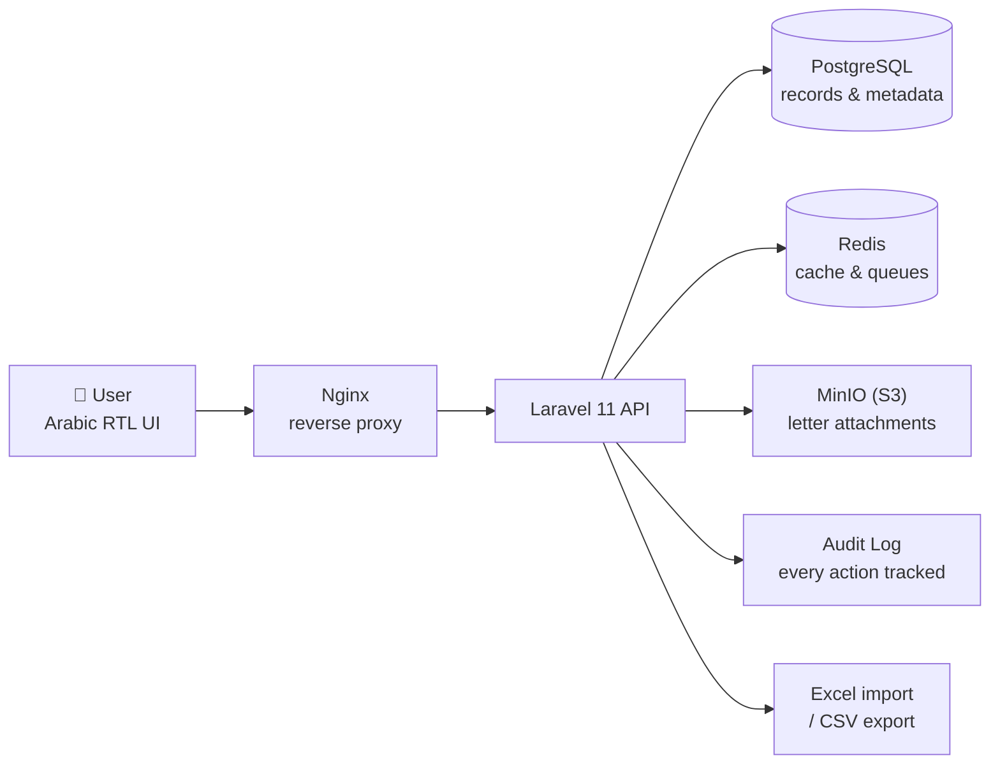
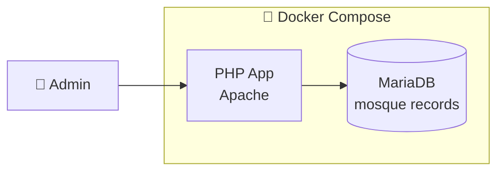

<!-- ============ ANIMATED HEADER ============ -->

<!-- ============ TYPING ANIMATION ============ -->

  

<!-- ============ BADGES ============ -->

  
  
  
  

 

<!-- ============ ABOUT ============ -->

### 👨‍💻 About Me

- 🚀 Full-stack developer who ships **production web apps end to end**
- 🧠 Flagship project **Qrib Lik** — an AI-powered local-services marketplace with multilingual (Darija) search
- 🛠️ Daily stack: **Angular · NestJS · Laravel · TypeScript · PostgreSQL/PostGIS · Docker**
- ✅ LinkedIn-verified assessments in **PHP, JavaScript, Java, Node.js, C, CSS, NoSQL, Linux**
- 🌍 Based in Morocco — building for the web, open to remote & freelance projects
- 💬 Ask me about full-stack architecture, AI integrations, or geospatial apps

 

---

### 🧰 Tech Stack

> 🔒 Most of my work is client-delivered or proprietary, so the source is private.
> Sensitive projects are shown as **architecture diagrams** and short case studies instead of screenshots.

---

## 🚀 Featured Projects

### 🟢 Qrib Lik — AI-Powered Local Services Marketplace

  
  

> **Problem.** Finding a trusted local professional (painter, electrician, plumber) usually means asking around or scrolling unverified listings.
>
> **What I built.** A marketplace where users describe a task in plain language — English, French, or **Moroccan Darija** ("bghit nsbgh l7it" → painter) — and the platform extracts intent with **Google Gemini**, then ranks nearby providers using **PostGIS** geospatial search and an explainable scoring system.
>
> **Engineering highlights.**
> - AI search pipeline with a deterministic keyword fallback — search never breaks when the AI is down, rate-limited, or low-confidence.
> - Prompt-injection-hardened AI layer — AI output is advisory only; deterministic backend rules own every final decision.
> - Explainable scoring split into provider-quality (**Qrib Score**) and request-relevance (**Match Score**).

**Stack:** `Angular 21 (Signals + SSR / Cloudflare Workers)` · `NestJS` · `PostgreSQL/PostGIS` · `Prisma` · `Google Gemini` · `Docker` · `Fly.io + Vercel`

---

### 🗂️ Meeting Management Platform  ·  *client-delivered*

> **Problem.** A council managed meetings, minutes, tasks, and documents across scattered files and email.
>
> **What I built.** A full-stack platform to schedule meetings, link minutes to sessions, track tasks, store documents, and manage contacts — with a calendar view, reports, notifications, and role-based permissions. Arabic RTL interface.

**Stack:** `Next.js 16` · `React 19` · `TypeScript` · `Laravel` · `PostgreSQL` · `Docker` · `Nginx` · `Oracle Cloud + Neon + Vercel`

---

### 🏖️ Leave Management System  ·  *client-delivered*

> **Problem.** A paper- and spreadsheet-based leave process, with manual balance tracking and hand-filled forms.
>
> **What I built.** A role-based HR/employee portal that calculates leave balances automatically, manages holidays and carry-over, and generates official leave forms and reports as one-click **Excel / PDF / Word** exports.

**Stack:** `Laravel 12` · `PHP 8.2` · `Blade` · `Tailwind CSS` · `MariaDB` · `Docker`

---

### 📨 InOutfiles — Correspondence Archive  ·  *client-delivered*

> **Problem.** Incoming and outgoing official letters were tracked on paper, making anything hard to find or audit.
>
> **What I built.** A document management system to register correspondence with attachments, search across all records instantly, import from Excel, and keep a full audit log of every action. S3-compatible file storage. Arabic RTL.
>
> *Holds confidential records, so the architecture is shown instead of the UI.*

**Stack:** `Laravel 11` · `PostgreSQL` · `Redis` · `MinIO (S3)` · `Nginx` · `Docker`

---

### 🕌 Mosques Management  ·  *client-delivered*

> **What I built.** A regional administration app for managing mosque records, fully containerized for easy deployment.
>
> *Holds sensitive administrative data, so the architecture is shown instead of the UI.*

**Stack:** `PHP` · `MariaDB` · `Docker`

---

## 📊 GitHub Analytics

  
  

<!-- ============ ACTIVITY GRAPH ============ -->

  

<!-- ============ SNAKE (requires action, see setup) ============ -->

  

---

<!-- ============ FOOTER ============ -->

  <h3>💼 Available for remote & freelance projects</h3>
  
Need a web app, API, or marketplace built and shipped? Let's talk.

  

<!--
============================================================
SETUP — read once, takes ~5 minutes
============================================================
1. Create a new PUBLIC repo named exactly "MarAb9" (same as your username).
2. Add this file as README.md → it renders at the top of github.com/MarAb9.
3. Mermaid diagrams (InOutfiles, Mosques) render automatically. Nothing to upload.

SNAKE ANIMATION (the contribution-grid snake at the bottom)
- It needs a GitHub Action to generate snake.svg. Without it, that one image is broken.
- In the MarAb9 repo, create .github/workflows/snake.yml with the Platane/snk action:

    name: Generate Snake
    on:
      schedule: [{ cron: "0 0 * * *" }]
      workflow_dispatch:
    jobs:
      generate:
        runs-on: ubuntu-latest
        steps:
          - uses: Platane/snk@v3
            with:
              github_user_name: ${{ github.repository_owner }}
              outputs: dist/snake.svg
          - uses: crazy-max/ghaction-github-pages@v3
            with:
              target_branch: output
              build_dir: dist
            env:
              GITHUB_TOKEN: ${{ secrets.GITHUB_TOKEN }}

- Run the workflow once (Actions tab → Generate Snake → Run workflow).
- If you don't want it, just delete the snake  block above.

OPTIONAL OUTCOMES (powerful)
- Add a real number to any case study, e.g.
  "Replaced a paper-based leave process used by ~120 staff."
============================================================
-->
